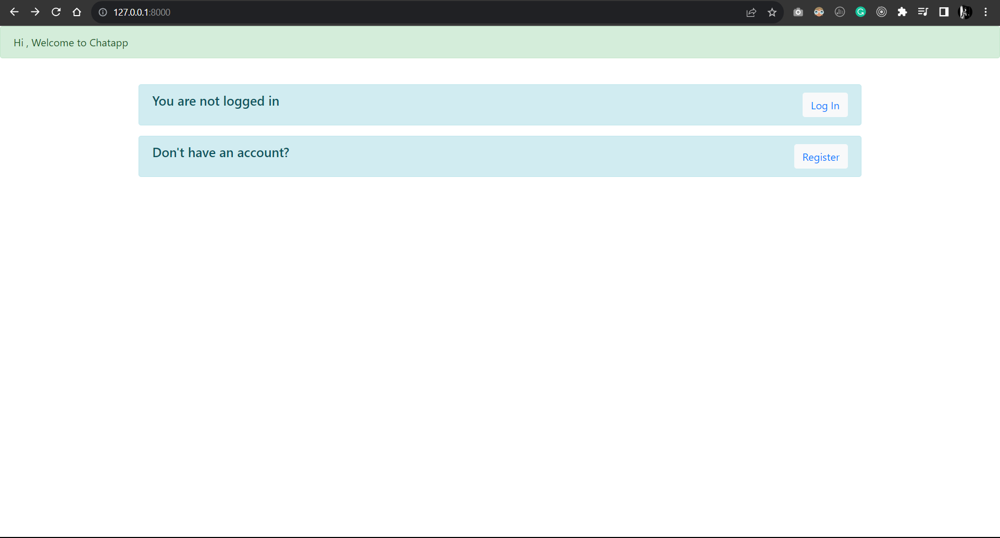
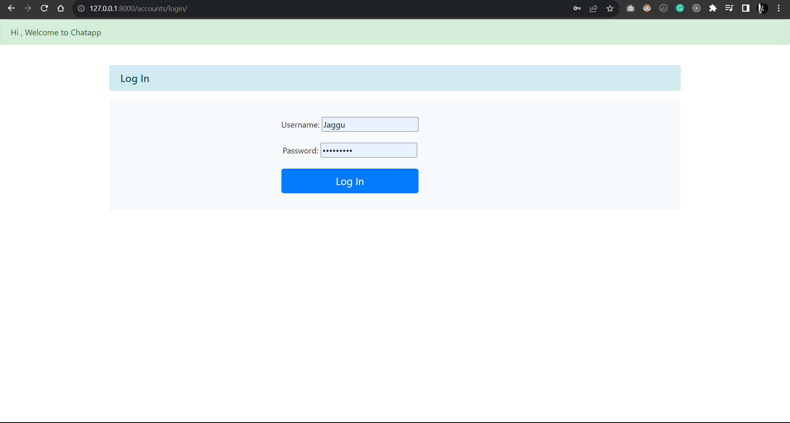
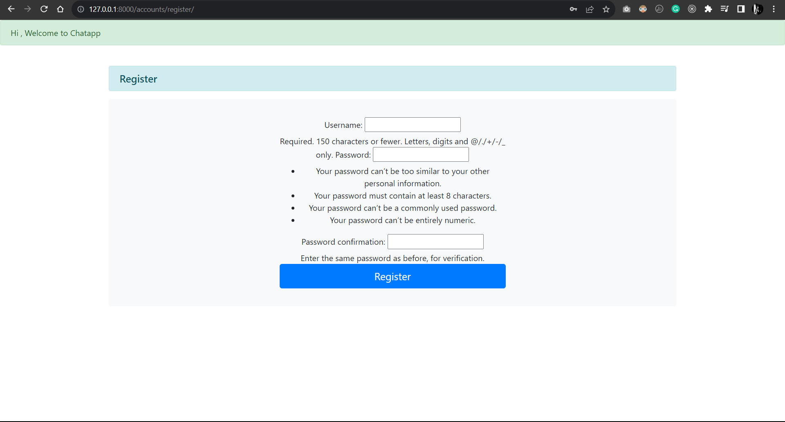
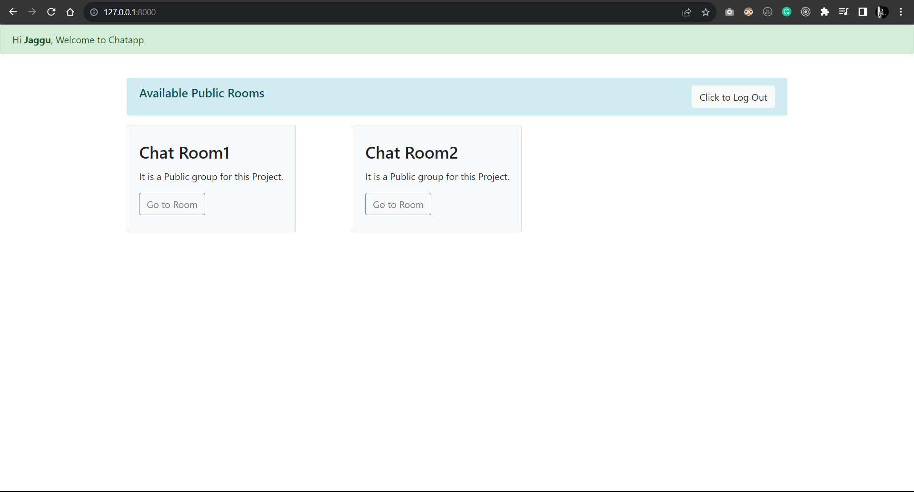
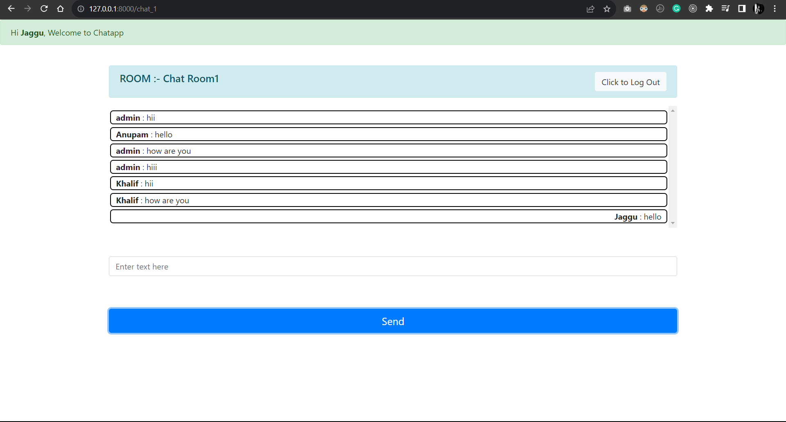

# Django Chat Application

This is a simple chat application built using Django and Django Channels. It allows users to join public chat rooms, send and receive messages, and see a list of online users in real-time.

## Features

- User registration and authentication.
- Joining public chat rooms.
- Real-time chat functionality using Django Channels and WebSocket.
- Display of online users.
- Responsive design for both desktop and mobile.

## Installation

1. Clone the repository to your local machine:

2. Create a virtual environment and activate it(env\Scripts\activate)

3. Install the project dependencies

4. Apply database migrations

5. Start the development server( python manage.py runserver )

6. Access the application in your web browser at `http://localhost:8000`.

## Usage

1. Register or log in to your account.

2. Browse the list of available public chat rooms and click on one to join.

3. Start chatting with other users in real-time.

4. You can also see a list of online users in the chat room.

5. To log out, click on the "Log Out" button.

## Technologies Used

- Django
- Django Channels
- HTML/CSS
- JavaScript

## Project Structure

- `firstapp/`: Django app containing the chat functionality.
- `templates/`: HTML templates for rendering pages.
- `chatapplication/`: Django project settings.

## Contributing

Contributions are welcome! If you'd like to contribute to this project, please follow these steps:

1. Fork the repository.
2. Create a new branch for your feature or bugfix.
3. Make your changes and commit them.
4. Push your changes to your fork.
5. Submit a pull request to the main repository.

## License

This project is licensed under the MIT License - see the [LICENSE](LICENSE) file for details.

## Acknowledgments

- Special thanks to the Django and Django Channels communities for their excellent documentation and support.

## Screenshots of the project

